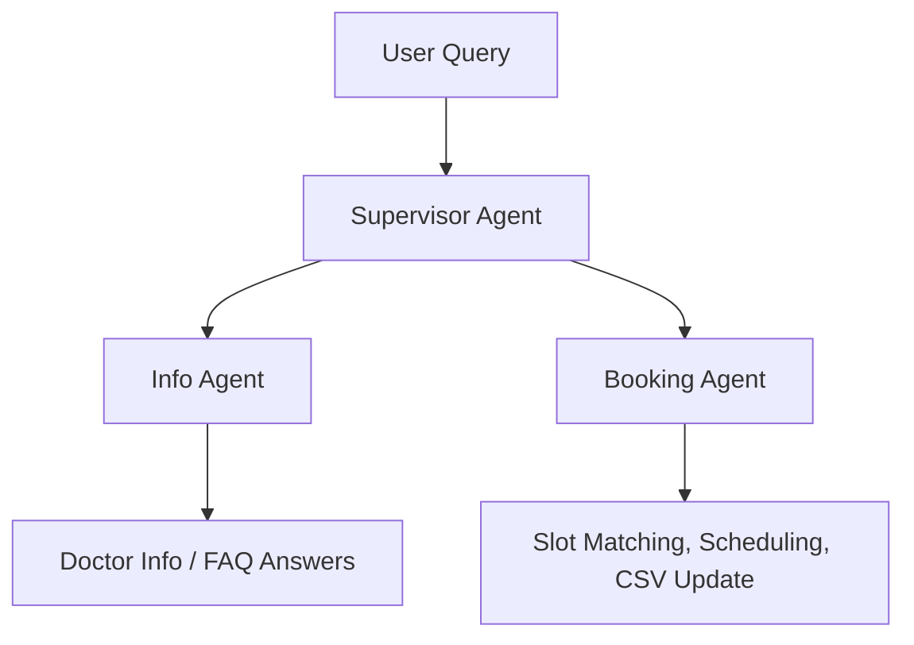

# 🏥 CareMate AI – Multi-Agent Medical Chatbot using LangGraph + Groq 

CareMate AI is an intelligent conversational assistant built for hospitals, powered by **LangGraph**, **Groq's blazing-fast inference**, and **Gemma-2B-IT**. It enables users to query doctor availability, ask hospital-related FAQs, and book/cancel/reschedule appointments — all through a multi-agent reasoning workflow.

> Uses a CSV of 4000+ doctor records and simulates a real appointment system with slot booking and natural language interaction.

---

## ✨ Features

- 🤖 **Multi-agent LLM assistant** with modular responsibilities  
- 🏥 Answer hospital FAQs and show doctor availability  
- 📅 Book, cancel, or reschedule appointments using chat  
- ⚡ Fast & intelligent responses with **Groq + Gemma-2B-IT**  
- 📊 Slot-based scheduling with CSV-backed storage  
- 📌 Intent routing via **Supervisor Agent**

---

## 🧪 Sample Interaction

```plaintext
🧍 User: What can you do?

🤖 AI: Hello! I can help you with doctor availability, hospital info, scheduling, canceling, or rescheduling appointments.

🧍 User: Tell me general dentists of this hospital available tomorrow.

🤖 AI: Found 2 general dentists available tomorrow:
- John Doe
- Elis Johnson

🧍 User: Book appointment with John Doe.

🤖 AI: John Doe is available tomorrow at:
- 08:00 AM
- 09:00 AM
- 11:30 AM
Please choose a time slot.

🧍 User: I want to schedule at 8 am.

🤖 AI: ✅ Appointment scheduled with John Doe at 08:00 AM tomorrow. Appointment ID: #APT12456
```

---

## 🧰 Tech Stack

| Component              | Description                                               |
|------------------------|-----------------------------------------------------------|
| **LangGraph**          | Multi-agent coordination and flow management              |
| **Groq + Gemma-2B-IT** | Lightning-fast LLM inference for conversation             |
| **LangChain**          | Prompt templating and tool invocation                     |
| **Pandas**             | CSV parsing, scheduling, and data filtering               |
| **Jupyter Notebook**   | Development and interaction via notebook                  |

---

## 🧠 Agent Workflow



- 🎯 **Supervisor Agent** – Routes user query to appropriate agent  
- 🧾 **Info Agent** – Handles doctor availability and hospital FAQs  
- 🗓️ **Booking Agent** – Manages schedule, cancel, and reschedule flows  

---

## 📁 Project Structure

```plaintext
caremate-ai/
├── requirements.txt                 # All dependencies
│
├── data/
│   └── doctor_availability.csv      # CSV with doctor schedules and specialties
│
├── notebooks/
│   └── multiagent_system.ipynb      # Main notebook with multi-agent pipeline
│
└── README.md                        # Project documentation
```

---

## ⚙️ Setup Instructions

```bash
# Clone the repo and move into the project folder
git clone https://github.com/Himanshupdt09/CareMate-Multi_Agentic_AI_Assistant.git
cd caremate-ai

# Create and activate virtual environment
python -m venv venv
source venv/bin/activate   # On Windows: venv\Scripts\activate

# Install dependencies
pip install -r requirements.txt

# Run the notebook
jupyter notebook notebooks/multiagent_system.ipynb
```

---

## 💬 Text Query Examples

```plaintext
🟢 "What can you do?"
🟢 "Tell me all general dentists available tomorrow."
🟢 "Schedule an appointment with John Doe."
🟢 "Cancel my appointment with Elis Johnson at 11 AM."
🟢 "Reschedule my appointment from 9 AM to 2 PM."
🟢 "What are your working hours?"
```

---

## 🔮 Future Improvements

- 🌐 Add a Streamlit / Flask frontend for web-based access  
- 🩺 Admin dashboard to manage appointments and doctor schedules  
- 🔔 Email / SMS notifications for confirmations and reminders  
- 🧠 Chat history and patient login support  
- 📅 Real-time slot conflict prevention using a proper database  

---

## 🧬 Built to revolutionize hospital workflows — one appointment at a time.
